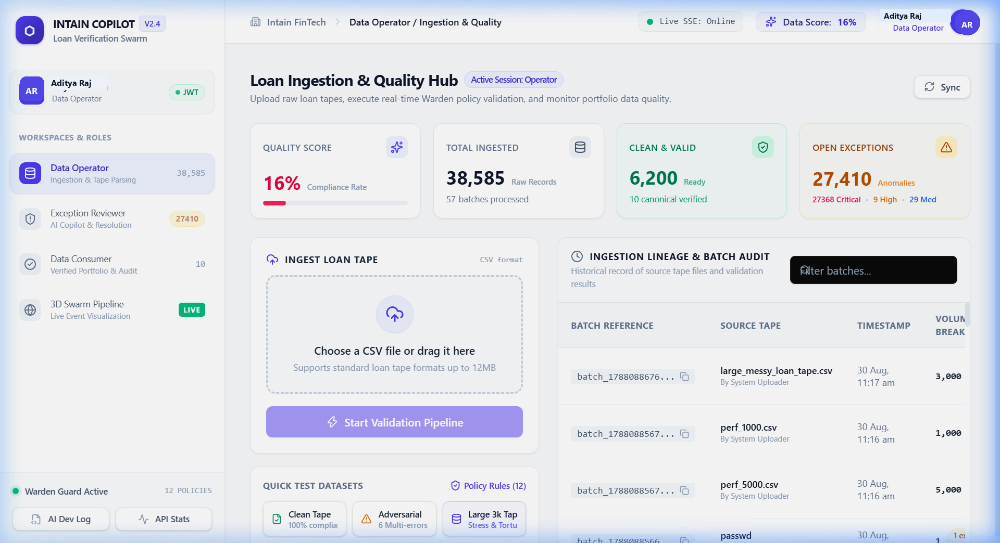
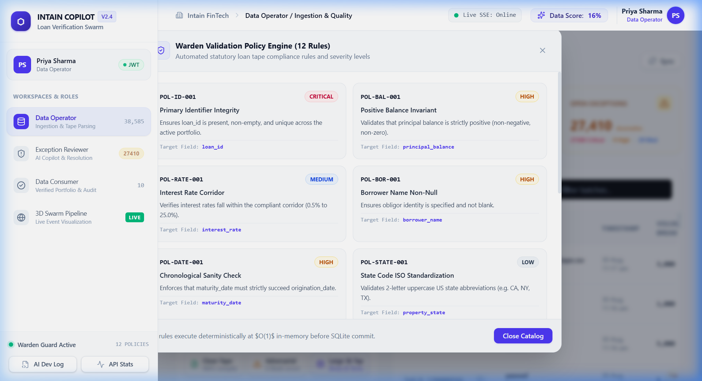
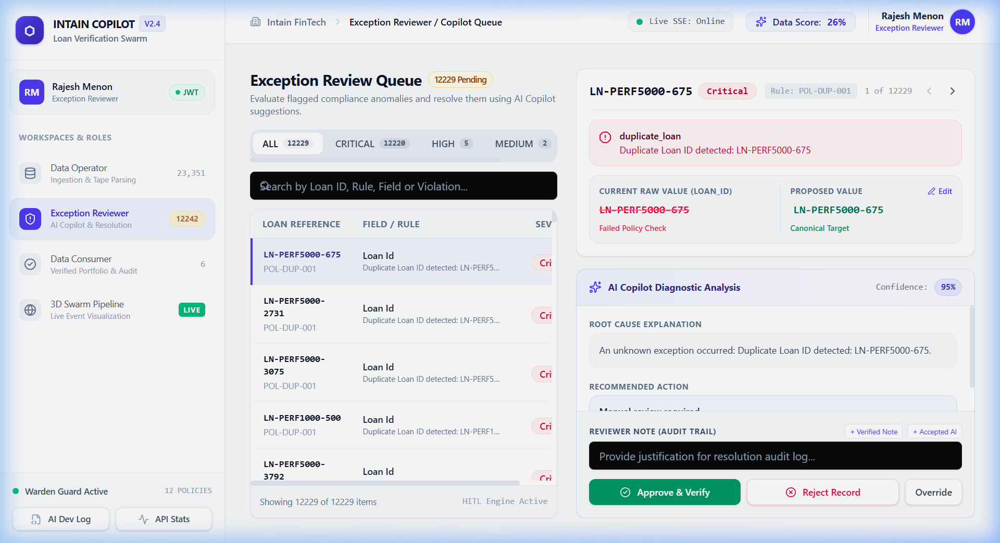
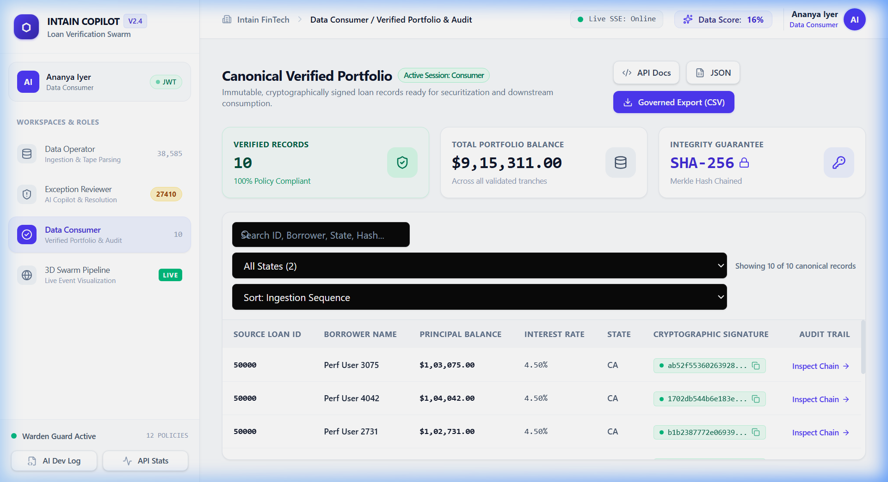
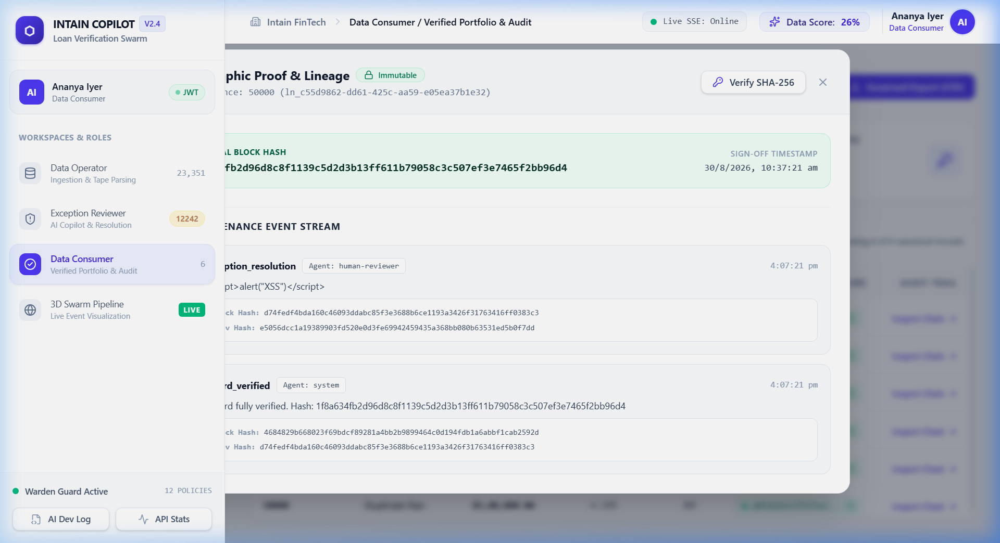

# 🏦 LoanGuard-AI — Loan Data Verification Copilot
> **An AI-Assisted, Cryptographically Verified Governance Platform for Financial Loan Tapes**  
> *An enterprise-grade platform for financial asset verification.*

---

## 🌟 What is this project about? 

### The Real-World Problem
When banks, mortgage lenders, and financial institutions buy or sell bundles of loans (called **"Loan Tapes"**), the data is almost always messy:
- **Typing Mistakes:** An interest rate written as `42%` instead of `4.2%`.
- **Negative Balances:** A loan showing a balance of `-$250,000` because someone entered a payment with the wrong sign.
- **Impossible Dates:** A mortgage expiring *before* it was even created (`Maturity: 2020` vs `Origination: 2025`).
- **Duplicate Records:** The same borrower and loan ID appearing twice.

If financial institutions use this bad data, they can face **millions of dollars in regulatory fines and financial losses**.

---

### How "LoanGuard-AI" Solves It
**LoanGuard-AI** is an intelligent full-stack financial workspace that acts like an automated quality gatekeeper:

```
┌────────────────────────┐      ┌─────────────────────────┐      ┌─────────────────────────┐
│ 1. Data Ingestion      │ ---> │ 2. AI Copilot Review    │ ---> │ 3. Cryptographic Seal   │
│ Ingest messy CSV tapes │      │ Explains errors & aids  │      │ Stamps an unbreakable   │
│ & catches anomalies    │      │ human decision makers   │      │ SHA-256 digital receipt │
└────────────────────────┘      └─────────────────────────┘      └─────────────────────────┘
```

1. **Catches Errors Instantly:** Automatically checks all rows against 12 strict financial rules in less than a second.
2. **AI Explains and Suggests Fixes:** When a mistake is found, an AI Assistant diagnoses *why* it happened and suggests the correct value.
3. **Humans Stay in Full Control:** The AI cannot change data by itself—a human reviewer must review and approve every fix.
4. **Tamper-Proof Audit Trail:** Once approved, every single change is stamped with an immutable cryptographic digital signature (like a digital wax seal). If anyone ever tries to tamper with the data, the seal breaks immediately.

---

## 🖥️ Visual Tour & How It Works

### Step 1: The Data Operator Workspace
*Where incoming loan spreadsheets are uploaded and inspected.*



- **One-Click Test Datasets:** Test with pre-loaded **Clean Tapes**, **Adversarial Multi-Error Tapes**, or stress-test with **3,000-Record Messy Tapes**.
- **Real-Time Data Quality Score:** Shows what percentage of the portfolio is clean vs flawed.
- **Batch Lineage History:** Keeps an exact log of who uploaded each file, when it arrived, and how many records passed or failed.

---

### Step 2: The Warden Policy Engine (12 Statutory Rules)
*The automated compliance gatekeeper.*



- Inspects every loan for:
  - **Negative Balances:** Rejects invalid negative amounts.
  - **Interest Rate Bounds:** Flags rates outside normal 0.5% – 25.0% corridors.
  - **Date Sequence Validity:** Ensures maturity is always after origination.
  - **Duplicate Interceptors:** Blocks duplicate IDs and identical borrower entries.
  - **State Code Normalization:** Converts state names like `"california"` into standard `"CA"`.

---

### Step 3: The Exception Reviewer & AI Copilot Workbench
*Where human specialists review flagged errors with AI assistance.*



- **Interactive Side-by-Side Diff Inspector:** Instantly see the raw corrupted data (in red strikethrough) compared against the proposed fix (in green).
- **AI Copilot Diagnostic Card:** Tells the reviewer:
  - *What went wrong* (e.g. "Missing decimal point in interest rate").
  - *How confident the AI is* (e.g. "95% confidence").
  - *Suggested Correction* (e.g. "Change 42% to 4.2%").
- **Human-In-The-Loop Sign-Off:** Reviewers can click **Apply Suggestion**, type their audit note, and click **Approve & Verify**.

---

### Step 4: The Data Consumer & Cryptographic Verification Studio
*Where verified, 100% pristine data is accessed by downstream buyers and regulators.*



- **Canonical Verified Portfolio:** Only loans that have passed all validation rules or been approved by human reviewers appear here.
- **State Filtering & Multi-Column Sorting:** Filter by state (`CA`, `NY`, `TX`, `WA`, etc.) and sort by balance or interest rate.
- **Governed CSV & JSON Export:** Securely download the verified dataset for securitization or reporting.

---

### Step 5: The Cryptographic Proof & Audit Ledger
*Proving zero data tampering with mathematical evidence.*



- **Blockchain-Style Hash Chaining:** Every single event (file upload → validation → AI review → reviewer sign-off) is chained using sequential SHA-256 mathematical hashes.
- **In-Browser SHA-256 Verification:** Click the **Verify SHA-256** button in the audit drawer to recalculate the math live in your browser and confirm zero data drift.

---

## 👥 Built-In User Roles & Test Personas

The application includes Role-Based Access Control (RBAC) powered by JSON Web Tokens (JWT). You can switch between active users directly from the top bar:

| Persona | Role | Permissions & Responsibilities |
| :--- | :--- | :--- |
| **Aditya Raj** | `Data Operator` | Uploads loan tapes, monitors quality scores, and inspects ingestion batches. |
| **Rajesh Menon** | `Exception Reviewer` | Investigates flagged anomalies, consults AI suggestions, and approves/rejects records. |
| **Ananya Iyer** | `Data Consumer` | Accesses clean verified portfolios, downloads governed exports, and inspects audit chains. |

---

## ⚡ Quick Start: How to Run in 2 Minutes

### 1. Prerequisites
- **Node.js** (v18 or newer installed)
- **npm** (comes with Node.js)

### 2. Installation & Launch
Open your terminal in the project folder and run:

```bash
# Step 1: Install all dependencies (backend & frontend)
npm install
cd web && npm install && cd ..

# Step 2: Build the frontend
npm run build:web

# Step 3: Start the server
npm start
# 🏦 LoanGuard-AI — Loan Data Verification Copilot
> **An AI-Assisted, Cryptographically Verified Governance Platform for Financial Loan Tapes**  
> *An enterprise-grade platform for financial asset verification.*

---

## 🌟 What is this project about? 

### The Real-World Problem
When banks, mortgage lenders, and financial institutions buy or sell bundles of loans (called **"Loan Tapes"**), the data is almost always messy:
- **Typing Mistakes:** An interest rate written as `42%` instead of `4.2%`.
- **Negative Balances:** A loan showing a balance of `-$250,000` because someone entered a payment with the wrong sign.
- **Impossible Dates:** A mortgage expiring *before* it was even created (`Maturity: 2020` vs `Origination: 2025`).
- **Duplicate Records:** The same borrower and loan ID appearing twice.

If financial institutions use this bad data, they can face **millions of dollars in regulatory fines and financial losses**.

---

### How "LoanGuard-AI" Solves It
**LoanGuard-AI** is an intelligent full-stack financial workspace that acts like an automated quality gatekeeper:

```
┌────────────────────────┐      ┌─────────────────────────┐      ┌─────────────────────────┐
│ 1. Data Ingestion      │ ---> │ 2. AI Copilot Review    │ ---> │ 3. Cryptographic Seal   │
│ Ingest messy CSV tapes │      │ Explains errors & aids  │      │ Stamps an unbreakable   │
│ & catches anomalies    │      │ human decision makers   │      │ SHA-256 digital receipt │
└────────────────────────┘      └─────────────────────────┘      └─────────────────────────┘
```

1. **Catches Errors Instantly:** Automatically checks all rows against 12 strict financial rules in less than a second.
2. **AI Explains and Suggests Fixes:** When a mistake is found, an AI Assistant diagnoses *why* it happened and suggests the correct value.
3. **Humans Stay in Full Control:** The AI cannot change data by itself—a human reviewer must review and approve every fix.
4. **Tamper-Proof Audit Trail:** Once approved, every single change is stamped with an immutable cryptographic digital signature (like a digital wax seal). If anyone ever tries to tamper with the data, the seal breaks immediately.

---

## 🖥️ Visual Tour & How It Works

### Step 1: The Data Operator Workspace
*Where incoming loan spreadsheets are uploaded and inspected.*


- **One-Click Test Datasets:** Test with pre-loaded **Clean Tapes**, **Adversarial Multi-Error Tapes**, or stress-test with **3,000-Record Messy Tapes**.
- **Real-Time Data Quality Score:** Shows what percentage of the portfolio is clean vs flawed.
- **Batch Lineage History:** Keeps an exact log of who uploaded each file, when it arrived, and how many records passed or failed.

---

### Step 2: The Warden Policy Engine (12 Statutory Rules)
*The automated compliance gatekeeper.*


- Inspects every loan for:
  - **Negative Balances:** Rejects invalid negative amounts.
  - **Interest Rate Bounds:** Flags rates outside normal 0.5% – 25.0% corridors.
  - **Date Sequence Validity:** Ensures maturity is always after origination.
  - **Duplicate Interceptors:** Blocks duplicate IDs and identical borrower entries.
  - **State Code Normalization:** Converts state names like `"california"` into standard `"CA"`.

---

### Step 3: The Exception Reviewer & AI Copilot Workbench
*Where human specialists review flagged errors with AI assistance.*


- **Interactive Side-by-Side Diff Inspector:** Instantly see the raw corrupted data (in red strikethrough) compared against the proposed fix (in green).
- **AI Copilot Diagnostic Card:** Tells the reviewer:
  - *What went wrong* (e.g. "Missing decimal point in interest rate").
  - *How confident the AI is* (e.g. "95% confidence").
  - *Suggested Correction* (e.g. "Change 42% to 4.2%").
- **Human-In-The-Loop Sign-Off:** Reviewers can click **Apply Suggestion**, type their audit note, and click **Approve & Verify**.

---

### Step 4: The Data Consumer & Cryptographic Verification Studio
*Where verified, 100% pristine data is accessed by downstream buyers and regulators.*


- **Canonical Verified Portfolio:** Only loans that have passed all validation rules or been approved by human reviewers appear here.
- **State Filtering & Multi-Column Sorting:** Filter by state (`CA`, `NY`, `TX`, `WA`, etc.) and sort by balance or interest rate.
- **Governed CSV & JSON Export:** Securely download the verified dataset for securitization or reporting.

---

### Step 5: The Cryptographic Proof & Audit Ledger
*Proving zero data tampering with mathematical evidence.*


- **Blockchain-Style Hash Chaining:** Every single event (file upload → validation → AI review → reviewer sign-off) is chained using sequential SHA-256 mathematical hashes.
- **In-Browser SHA-256 Verification:** Click the **Verify SHA-256** button in the audit drawer to recalculate the math live in your browser and confirm zero data drift.

---

## 👥 Built-In User Roles & Test Personas

The application includes Role-Based Access Control (RBAC) powered by JSON Web Tokens (JWT). You can switch between active users directly from the top bar:

| Persona | Role | Permissions & Responsibilities |
| :--- | :--- | :--- |
| **Aditya Raj** | `Data Operator` | Uploads loan tapes, monitors quality scores, and inspects ingestion batches. |
| **Rajesh Menon** | `Exception Reviewer` | Investigates flagged anomalies, consults AI suggestions, and approves/rejects records. |
| **Ananya Iyer** | `Data Consumer` | Accesses clean verified portfolios, downloads governed exports, and inspects audit chains. |

---

## ⚡ Quick Start: How to Run in 2 Minutes

### 1. Prerequisites
- **Node.js** (v18 or newer installed)
- **npm** (comes with Node.js)

### 2. Installation & Launch
Open your terminal in the project folder and run:

```bash
# Step 1: Install all dependencies (backend & frontend)
npm install
cd web && npm install && cd ..

# Step 2: Build the frontend
npm run build:web

# Step 3: Start the server
npm start
```

Open your web browser and navigate to: **`http://localhost:8080`**

---

## 🛠️ Technical Architecture & Stack Summary

`mermaid
graph TD
    subgraph Frontend [React + Vite + Tailwind]
        O[Data Operator View]
        R[Exception Reviewer]
        C[Data Consumer]
    end
    subgraph Backend [Node.js + Express]
        API[REST API]
        W[Warden Policy Engine]
        AI[AI Copilot]
    end
    subgraph Database [SQLite]
        DB[(Loan Database)]
        AL[Cryptographic Audit Log]
    end
    O --> API
    R --> API
    C --> API
    API --> W
    API --> AI
    W --> DB
    W --> AL
    AI --> AL
``n

- **Frontend:** React 18, Vite, Tailwind CSS, Framer Motion, Lucide Icons, React Three Fiber (3D pipeline visualizer).
- **Backend:** Node.js, Express.js (REST API, SSE live event streaming).
- **Security & RBAC:** Stateless JWT tokens (`jsonwebtoken`), input sanitization (`DOMPurify` + `JSDOM`).
- **Database & Audit:** SQLite with in-memory index caching and SHA-256 cryptographic hash-chained audit ledgers.
- **Test Suite:** 54 automated adversarial torture tests (`node brutal_qa.js` -> 100% PASS).

---

## 📡 REST API Reference (Module H Specification)

| Method | Endpoint | Allowed Role | Purpose |
| :--- | :--- | :--- | :--- |
| `GET` | `/api/loans` (alias `/loans`) | Public | Returns recent ingested loans |
| `GET` | `/api/loans/:id` (alias `/loans/:id`) | Public | Lookup single loan by ID |
| `GET` | `/api/exceptions` (alias `/exceptions`) | Public | Fetch all open validation exceptions |
| `GET` | `/api/verified-loans` (alias `/verified-loans`) | Public | Fetch all canonical verified loans |
| `GET` | `/api/verified-loans/:id` (alias `/verified-loans/:id`) | Public | Lookup single verified loan |
| `GET` | `/api/audit/:loanId` (alias `/audit/:loanId`) | Public | Retrieve complete cryptographic hash chain |
| `GET` | `/api/summary` (alias `/summary`) | Public | Real-time portfolio quality metrics |
| `GET` | `/api/export/verified-loans` | `consumer` | Governed streaming CSV export |
| `POST` | `/api/upload` | `operator` | Multipart tape ingestion & policy execution |
| `PATCH`| `/api/exceptions/:id` | `reviewer` | Human-in-the-loop exception sign-off |
| `POST` | `/api/ai-review` | `reviewer` | AI Copilot diagnostic analysis |

---

## 📄 Key Project Documentation Files
- **[README.md](./README.md):** User guide, visual walkthrough, and setup instructions.
- **[architecture_note.md](./architecture_note.md):** Detailed 2-page engineering architecture note.
- **[ai_development_log.md](./ai_development_log.md):** Mandatory Agentic Coding lifecycle log.
- **[qa_test_report.md](file:///C:/Users/Lenovo/.gemini/antigravity-ide/brain/44f827a4-1623-428b-a748-67e84291df1a/qa_test_report.md):** Complete 54-point adversarial QA test report.
- **[walkthrough.md](file:///C:/Users/Lenovo/.gemini/antigravity-ide/brain/44f827a4-1623-428b-a748-67e84291df1a/walkthrough.md):** Screenshots and session recordings.

---

