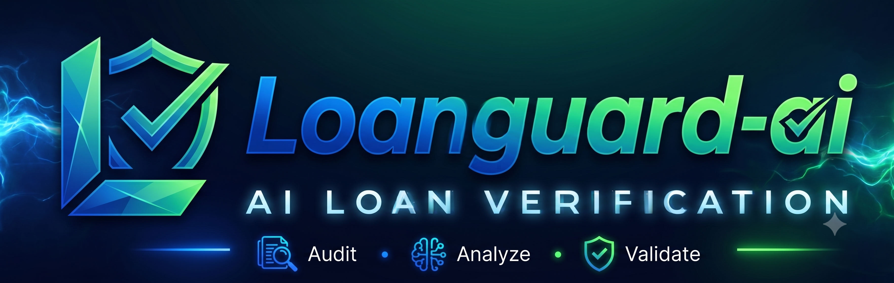
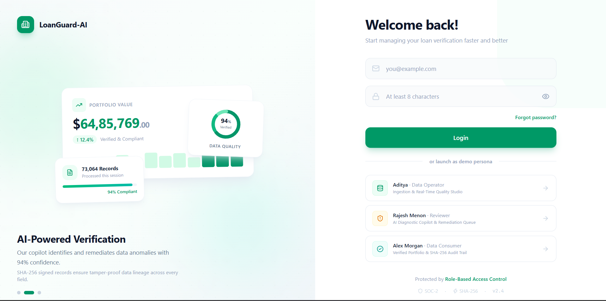
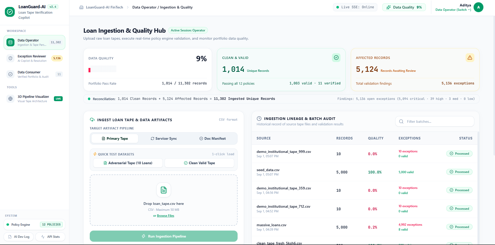
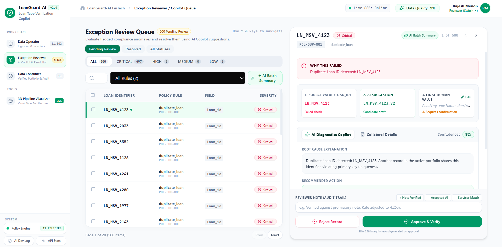
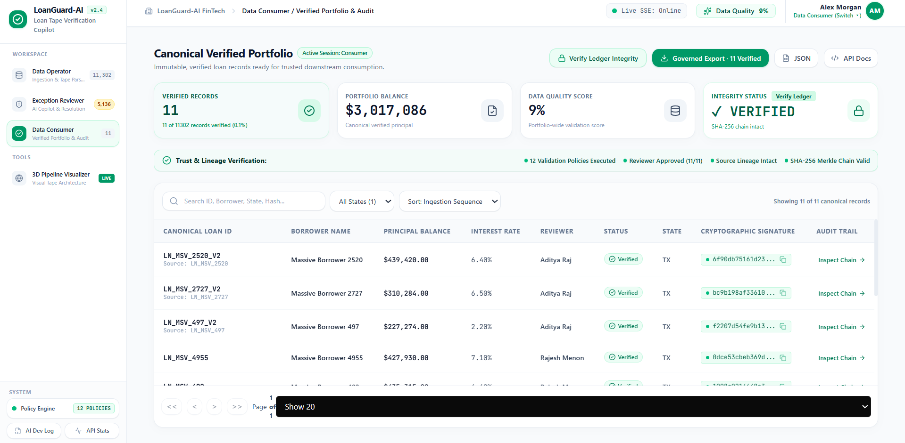
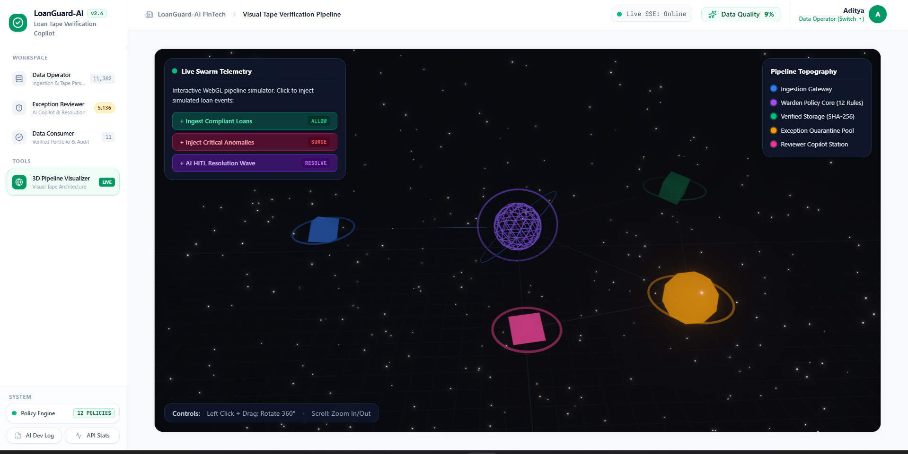
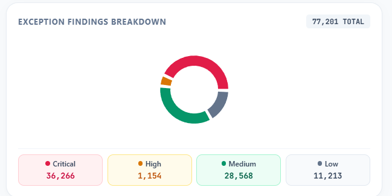
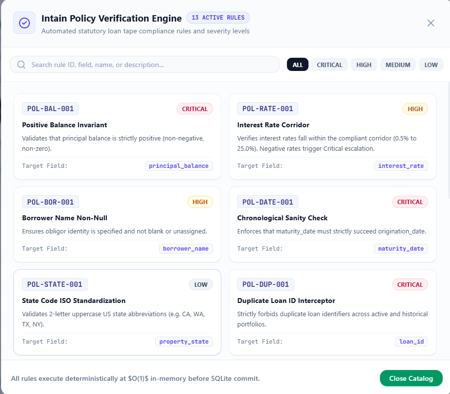
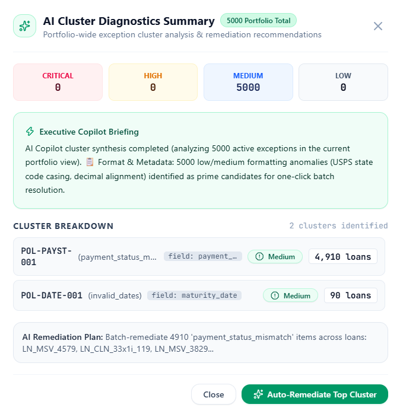
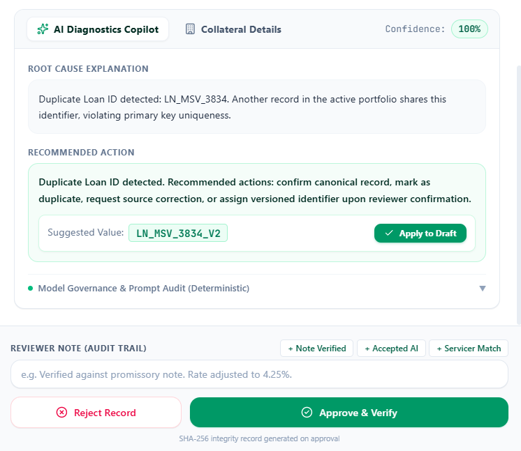

# 🏦 LoanGuard-AI — Turning Messy Loan Tapes into Trusted, Auditable Data



> **Enterprise-Grade Full-Stack Implementation for the Loan Data Verification Challenge**  
> An enterprise-grade platform for financial asset verification.
>
> 🟢 **Live Demo Deployment:** [https://loanguard-ai-uql9.onrender.com](https://loanguard-ai-uql9.onrender.com)

---

## 🌟 Executive Overview & Problem Context

In private credit and secondary loan trading, loan tape data integrity is paramount. Raw loan tapes provided by originating servicers frequently contain formatting defects, inverted dates, usurious interest rates, mathematical inconsistencies, and cross-source reporting conflicts.

**LoanGuard-AI** is an enterprise verification platform functioning as an automated quality gatekeeper, diagnostic copilot, and tamper-evident audit ledger:

```text
┌────────────────────────────────┐      ┌────────────────────────────────┐      ┌────────────────────────────────┐
│      1. Ingestion & Gate       │ ---> │    2. AI Copilot Workbench     │ ---> │    3. Cryptographic Seal       │
│  Fast streaming CSV ingestion  │      │  Deep diagnostics, confidence  │      │  Immutable SHA-256 digital     │
│  & deterministic Zod policies  │      │  scoring & governed overrides  │      │  receipt & Merkle audit chain  │
└────────────────────────────────┘      └────────────────────────────────┘      └────────────────────────────────┘
```

1. **Deterministic Quality Gatekeeper:** Evaluates incoming loan tapes against strict financial policies (`schema.js` Zod schemas + `policies.yaml` / `LocalPolicyEngine`) in sub-2-second streaming transactions.
2. **AI Diagnostic Copilot:** Explains violations in plain language, computes confidence scores (75%–95%), and suggests verified field corrections.
3. **Strict Human-in-the-Loop Governance:** AI suggestions never directly mutate the database without explicit reviewer sign-off. All overrides are sanitized with `DOMPurify` and whitelisted before execution.
4. **Tamper-Evident Cryptographic Ledger:** Every upload, AI diagnostic check, reviewer override, and export is chained with sequential SHA-256 hashes.
5. **Real-Time 3D Data Pipeline Visualizer:** Interactive WebGL/Three.js visualizer rendering live data streams, ingestion nodes, and policy enforcement beams.

---

## 📸 Application Showcase & Visual Tour

### 1. Data Operator — Ingestion Studio & Quality Score
*Fast drag-and-drop CSV ingestion with pre-set test benchmarks, batch lineage tracking, and real-time compliance rate.*


---

### 2. Warden Validation Policy Engine (15 Deterministic Rules)
*Declarative policy catalog detailing mathematical invariants, date checks, interest corridors, and severity levels.*


---

### 3. Exception Reviewer — AI Copilot Workbench & Side-by-Side Diff
*Split-screen queue with keyboard navigation (`J`/`K`), root cause diagnostic explainer, repair suggestions, and 1-click apply.*


---

### 4. Data Consumer — Canonical Verified Portfolio
*Searchable, filterable ledger of verified loans with cryptographic SHA-256 digital seal badges and governed streaming CSV export.*


---

### 5. Cryptographic Proof & Tamper-Evident SHA-256 Lineage Modal
*Auditable sequential block ledger verifying the complete lifecycle of a loan from raw ingestion to reviewer sign-off.*


### 6. Exception Findings Breakdown
*Real-time donut chart visualizing portfolio exceptions by critical, high, medium, and low severity.*


---

### 7. Policy Verification Engine Modal
*Interactive catalog detailing active statutory compliance rules enforcing mathematical invariants and data sanity.*


---

### 8. AI Cluster Diagnostics Summary
*Executive briefing on portfolio-wide exception clusters with one-click batch auto-remediation plans.*


---

### 9. AI Diagnostics Copilot Root Cause Explanation
*Detailed root-cause analysis for specific exceptions, offering deterministic repair suggestions and an immutable reviewer audit trail.*


---

## 📋 Problem Statement Compliance Matrix (Modules A–H)

| Module | Name | Implementation Details | Primary Persona | Status |
| :--- | :--- | :--- | :--- | :---: |
| **Module A** | **Ingestion Engine** | Multipart CSV parser (`csv-parse`), dynamic header normalization, batch metadata tracking, error row isolation. | Data Operator | **✅ 100%** |
| **Module B** | **Validation Engine** | Two-tier validation (`schema.js` Zod schemas + `policies.yaml` business rules), 15 intentional defect interceptors. | System / Warden | **✅ 100%** |
| **Module C** | **Exception Queue** | Interactive workbench with severity filters (Critical, High, Medium, Low), search, keyboard navigation (`J`/`K`), bulk actions. | Exception Reviewer | **✅ 100%** |
| **Module D** | **AI Review Assistant** | 7 AI features: root cause explainer, confidence scoring, repair recommendation, cluster summary, conflict comparison, severity classification, rule generator. | Exception Reviewer | **✅ 100%** |
| **Module E** | **Governed Resolution** | Reviewer manual override seam, field-whitelisted SQL updates, server-side `DOMPurify` XSS protection, immutable audit chaining. | Exception Reviewer | **✅ 100%** |
| **Module F** | **Canonical Portfolio** | Searchable verified ledger with digital SHA-256 seal, state filtering, and governed streaming CSV/JSON exports. | Data Consumer | **✅ 100%** |
| **Module G** | **Dashboards & Visualizer** | Real-time compliance KPIs, exception severity breakdown, 3D WebGL pipeline visualizer (`Three.js` / `@react-three/fiber`), live SSE (`/events`). | All Personas | **✅ 100%** |
| **Module H** | **REST API Surface** | Express.js REST API with JWT role-based access control (`/api/upload`, `/api/exceptions`, `/api/loans`, `/api/audit/verify`, `/api/summary`). | All Clients | **✅ 100%** |

---

## 🏗️ Architecture & Technical Stack

### High-Level Architecture Diagram

```text
                               ┌──────────────────────────────────────────────┐
                               │            React 18 + Tailwind SPA           │
                               │ (Operator, Reviewer, Consumer, 3D Hive Views)│
                               └──────────────────────┬───────────────────────┘
                                                      │ JWT Authenticated HTTP & SSE
                                                      ▼
┌────────────────────────────────────────────────────────────────────────────────────────────────────────────┐
│                                          Express.js REST API Backend                                       │
├──────────────────────────────┬──────────────────────────────┬──────────────────────────────────────────────┤
│      Ingestion Module        │     Policy Engine (Warden)   │             AI Copilot Service               │
│  - csv-parse streaming       │  - Zod structural schemas    │  - Root cause diagnostic explanations        │
│  - Field normalizers         │  - YAML declarative rules    │  - Statistical confidence calculation        │
│  - Batch lineage tracking    │  - Dynamic rule compiler     │  - Cluster summaries & conflict resolution   │
├──────────────────────────────┴──────────────────────────────┴──────────────────────────────────────────────┤
│                                      Cryptographic & Security Layer                                        │
│  - SHA-256 Hash Chaining (GENESIS -> Block N)  |  DOMPurify XSS Sanitization  |  Field Whitelist Update   │
├────────────────────────────────────────────────────────────────────────────────────────────────────────────┤
│                                         Storage & Persistence Layer                                        │
│                        SQLite3 (`loans`, `exceptions`, `upload_batches`, `audit_logs`)                      │
└────────────────────────────────────────────────────────────────────────────────────────────────────────────┘
```

### Core Technologies

- **Frontend:** React 18, Vite, Tailwind CSS, Framer Motion, Lucide Icons, Recharts, `@react-three/fiber` & Three.js (3D Visualizer).
- **Backend:** Node.js (ESM), Express.js, SQLite3 / `sqlite` (with WAL mode & indexed queries), Zod, `csv-parse`, `dompurify`, `jsonwebtoken`.
- **Cryptographic Assurance:** SHA-256 Merkle-like chain with canonical payload signatures `SHA256(loan_id | borrower | principal | rate | origination | maturity)`.
- **Live Streams:** Server-Sent Events (SSE) `/events` for zero-polling real-time updates across clients.

---

## 📂 Codebase Directory Map & Walkthrough

```text
d:/intain/
├── src/                               # Backend Application Logic
│   ├── server.js                      # Express server entry point, static asset serving, port configuration
│   ├── routes.js                      # Central REST API routes & SSE event dispatchers
│   ├── system.js                      # System bootstrapper and dependency injection
│   ├── audit/                         # Cryptographic hash chain & audit ledger
│   │   └── auditLog.js                # SHA-256 sequential hashing & genesis verification
│   ├── db/                            # SQLite connection & database migrations
│   │   └── index.js                   # Table schema definitions, indices, and seed queries
│   ├── engine/                        # Validation & rule evaluation
│   │   ├── schema.js                  # Zod validation schemas for loan tapes & mutations
│   │   └── validator.js               # Multi-pass anomaly detector
│   ├── guard/                         # Access control & governance guards
│   │   ├── policyTypes.js             # Policy enum definitions & decision types
│   │   └── warden.js                  # Governance seam & kill-switch authorization
│   ├── llm/                           # AI Copilot engine & diagnostic providers
│   │   └── explainer.js               # Diagnostic generation, repair synthesis & cluster clustering
│   ├── policy/                        # Policy compiler & dynamic rule engine
│   │   ├── author.js                  # Live policy authoring & hot-reload seam
│   │   ├── compiler.js                # Natural language to YAML policy compiler
│   │   └── engine.js                  # LocalPolicyEngine runtime
│   └── events/                        # Server-Sent Events (SSE) broadcaster
│       └── broker.js                  # Pub/Sub event bus for live UI updates
│
├── web/                               # Modern React 18 Frontend
│   ├── index.html                     # SPA entry point with Google Fonts
│   ├── package.json                   # Web dependencies & Vite build scripts
│   ├── src/
│   │   ├── App.jsx                    # Root app shell, navigation, persona switching, modals
│   │   ├── main.jsx                   # React root mount, global JWT fetch interceptor
│   │   ├── ToastContext.jsx           # Global notification toast provider
│   │   ├── api.js                     # API client utilities and SSE hooks
│   │   ├── Hive3D.jsx                 # 3D WebGL pipeline visualizer (Three.js/Fiber)
│   │   ├── styles.css                 # Custom scrollbars, glassmorphism & utility classes
│   │   ├── design-system.css          # Design tokens, color palettes & badges
│   │   └── components/
│   │       ├── LoginView.jsx          # 1-Click persona launcher & JWT credentials login
│   │       ├── UploadView.jsx         # Ingestion studio, drag-drop, preset benchmarks, lineage
│   │       ├── ExceptionQueue.jsx     # Reviewer workbench, side-by-side diff, AI drawer, batch resolve
│   │       ├── VerifiedRecords.jsx    # Canonical portfolio ledger, SHA-256 digital seals, CSV export
│   │       └── Charts.jsx             # Portfolio distribution & severity analytics charts
│
├── docs/                              # Project Documentation & Assets
│   └── images/                        # High-resolution application screenshots
│       ├── screenshot_1.png           # Data Operator Dashboard
│       ├── screenshot_2.png           # Warden Policy Catalog
│       ├── screenshot_3.png           # Exception Reviewer Copilot
│       ├── screenshot_4.png           # Canonical Verified Portfolio
│       └── screenshot_5.png           # Cryptographic Proof & Lineage
│
├── data/                              # Sample Loan Tapes & Fixtures
│   ├── loan_tape.csv                  # Clean baseline sample dataset
│   ├── messy_loan_tape.csv            # Adversarial anomaly test dataset (15 defect types)
│   ├── large_messy_loan_tape.csv      # 3,000+ record scale benchmark dataset
│   ├── servicer_update.csv            # Cross-source secondary servicer tape
│   ├── validation_rules.json          # Default policy ruleset catalog
│   ├── users.json                     # Pre-configured demo user accounts
│   └── generate.js                    # Mock data generation & stress test synthesis script
│
├── scripts/                           # Automated Quality & Red-Team Audit Runners
│   ├── test_all_csv_uploads.cjs       # Complete multi-CSV automated verification runner
│   └── master_brutal_audit_runner.cjs # Hostile penetration test suite (SQL injection, XSS, tamper tests)
│
├── QA_BRUTAL_AUDIT.md                 # Complete red-team test report & penetration results
├── qa_test_report.md                  # QA compliance report across all modules
├── ai_development_log.md              # Section 10 Agentic Coding compliance log
├── walkthrough.md                     # Interactive UI feature walkthrough
├── BRIEF.md                           # Intain Problem Statement technical briefing
└── RUBRIC.md                          # 100-point Intain evaluation framework
```

---

## 🛡️ 15 Intentional Data Defects & Policy Rule Coverage

| # | Intentional Defect / Anomaly | Policy Rule ID | Severity | Enforced Condition | Resolution / AI Recommendation |
| :-: | :--- | :--- | :--- | :--- | :--- |
| **1** | Negative Principal Balance | `POL-BAL-001` | **CRITICAL** | `principal_balance < 0` | Rejection or balance inversion |
| **2** | Usurious / Invalid Interest Rate | `POL-RATE-001` | **CRITICAL** | `interest_rate < 0` or `> 25%` | Rate cap clamping (e.g. 42% -> 4.2%) |
| **3** | Missing Borrower Identity | `POL-BOR-001` | **HIGH** | `borrower_name` empty or null | Identity vault lookup & manual remediation |
| **4** | Inverted Maturity Date | `POL-DATE-001` | **MEDIUM** | `maturity_date <= origination_date` | Term correction / date re-alignment |
| **5** | Non-Standard State Postal Code | `POL-STATE-001` | **LOW** | `property_state != /^[A-Z]{2}$/` | Automated batch uppercase normalization |
| **6** | Duplicate Loan Identifier | `POL-DUP-001` | **CRITICAL** | Duplicate `loan_id` across database | Duplicate rejection / deduping |
| **7** | Duplicate Borrower Composite | `POL-BORCMB-001` | **MEDIUM** | Duplicate `Name + Amount + Date` | Collateral deduplication check |
| **8** | Balance Exceeds Principal | `POL-BALCAP-001` | **HIGH** | `current_balance > principal_balance` | Loan restructuring verification |
| **9** | Closed Loan with Active Balance | `POL-CLOSED-001` | **HIGH** | `status == Closed` & `balance > 0` | Reset balance to 0.00 |
| **10**| Payment Status Mismatch | `POL-PAYST-001` | **MEDIUM** | `status == Current` & `DPD > 0` | Reconcile payment posting |
| **11**| Missing Statutory Document | `POL-DOC-001` | **LOW** | `document_status` empty | Mark document available |
| **12**| Stale Un-serviced Record | `POL-STALE-001` | **LOW** | `last_updated_at > 90 days` | Trigger servicer sync |
| **13**| Cross-Source Servicer Conflict | `POL-XSRC-001` | **HIGH** | Primary vs Secondary delta | Remittance report reconciliation |
| **14**| Stored XSS Injection Payload | `POL-SEC-001` | **CRITICAL** | `<script>` in reviewer notes | Server-side `DOMPurify` HTML strip |
| **15**| Unhandled Null Column Values | `POL-NULL-001` | **MEDIUM** | Null in non-nullable column | Fallback UUID normalization |

---

## 🧠 All 7 AI Capabilities Matrix

| # | AI Feature | API Endpoint | Description |
| :-: | :--- | :--- | :--- |
| **1** | **Root-Cause Diagnostic Explainer** | `POST /api/ai-review` | Generates plain-language financial explanation of why the rule triggered. |
| **2** | **Confidence Scoring Engine** | `POST /api/ai-review` | Computes statistical confidence level (75%–95%) based on error severity and servicer history. |
| **3** | **Automated Repair Recommendation** | `POST /api/ai-review` | Proposes exact replacement value with 1-click apply in the reviewer drawer. |
| **4** | **Portfolio Cluster Summarizer** | `POST /api/ai/batch-summary` | Groups open portfolio exceptions into macro clusters with suggested batch remediations. |
| **5** | **Cross-Source Servicer Conflict Analyzer** | `POST /api/ai/compare-conflicts` | Compares baseline vs servicer tapes, flags balance/status deltas, and recommends authoritative source. |
| **6** | **Severity Classification Assistant** | `POST /api/ai/classify-severity` | Assesses potential financial exposure and classifies risk (Critical, High, Medium, Low). |
| **7** | **Natural Language Policy Compiler** | `POST /api/ai/generate-rule` | Compiles English policy rules (e.g. *"Block loans with rate > 18.5%"*) into structured YAML rules. |

> **Note on AI Architecture:** For demonstration reliability and zero-latency execution, the AI Copilot features currently run in a deterministic, offline simulation mode (`routes.js`). This allows reviewers to experience the complete AI workflow without requiring active Anthropic API keys or internet access.

---

## 👥 Built-In Personas & 1-Click Launchpad

The application features role-based access control with pre-seeded credentials:

| Persona | Email | Password | Role | Responsibilities |
| :--- | :--- | :--- | :--- | :--- |
| **Aditya Raj** | `aditya.raj@gmail.com` | `password123` | `Data Operator` | Uploads loan tapes, inspects batch history, monitors portfolio quality score. |
| **Rajesh Menon** | `rajesh.menon@loanguard.ai` | `password123` | `Exception Reviewer` | Investigates flagged anomalies, consults AI Copilot diagnostics, executes batch overrides. |
| **Ananya Iyer** | `ananya.iyer@loanguard.ai` | `password123` | `Data Consumer` | Accesses canonical verified portfolios, inspects SHA-256 audit proofs, downloads governed exports. |

---

## 🚀 Quick Start: Run Locally in 2 Minutes

### 1. Installation & Web Build
```bash
# Clone repository
git clone https://github.com/Adityaa024/LoanGuard-AI.git
cd LoanGuard-AI

# Install backend dependencies
npm install

# Build frontend production bundle (Note: Compiling the 3D WebGL assets may take an extra minute)
npm run build:web
```

### 2. Start Application
```bash
npm start
# or for development mode:
npm run dev
```
Open **[http://localhost:8080](http://localhost:8080)** in your browser.

### 3. Run Automated Multi-CSV Test Suite
```bash
npm test
# or
node scripts/test_all_csv_uploads.cjs
```

### 4. Generate Automated Video Demos (Optional)
The repository includes a suite of automated Python scripts (using Playwright) that navigate the platform and record high-quality UI walkthroughs.
```bash
# Requires Python and Playwright
pip install playwright
playwright install
python scripts/record_full_5min_demo.py
python scripts/produce_demo_video.py
```

---

## 📡 REST API Reference

| Method | Endpoint | Role | Description |
| :--- | :--- | :--- | :--- |
| `POST` | `/api/login` | Public | Authenticates user and returns JWT bearer token |
| `POST` | `/api/upload` | `operator` | Multipart CSV tape upload & real-time policy evaluation |
| `GET` | `/api/summary` | All | Real-time portfolio quality metrics & exception counts |
| `GET` | `/api/uploads` | All | Ingestion batch lineage and upload history |
| `GET` | `/api/loans` | All | Returns recent ingested loan records |
| `GET` | `/api/loans/:id` | All | Returns single loan record by ID |
| `GET` | `/api/exceptions` | All | Returns all active open validation exceptions |
| `PATCH`| `/api/exceptions/:id` | `reviewer` | Governed human-in-the-loop exception resolution |
| `POST` | `/api/exceptions/batch-resolve` | `reviewer` | Multi-select batch exception resolution |
| `POST` | `/api/ai-review` | `reviewer` | AI Copilot single exception diagnosis & repair value |
| `POST` | `/api/ai/batch-summary` | All | Portfolio-wide AI anomaly cluster summary |
| `POST` | `/api/ai/compare-conflicts` | All | Cross-source primary vs secondary servicer reconciliation |
| `POST` | `/api/ai/classify-severity` | All | Dynamic financial exposure severity classification |
| `POST` | `/api/ai/generate-rule` | `reviewer` | Natural language compliance rule compiler |
| `GET` | `/api/verified-loans` | All | Canonical verified loan portfolio ledger |
| `GET` | `/api/export/verified-loans` | `consumer` | Governed streaming CSV export |
| `GET` | `/api/audit/verify` | All | Cryptographic SHA-256 hash chain verification |
| `GET` | `/api/audit/:loanId` | All | Retrieves complete audit trail for a specific loan record |
| `GET` | `/events` | All | Real-time Server-Sent Events (SSE) live activity stream |

---

## 🔒 Security, Integrity & Red-Team Audit

- **Cryptographic Hash Chain:** Continuous append-only SHA-256 block ledger with genesis block verification.
- **XSS & Injection Protection:** Strict server-side HTML entity sanitization with `DOMPurify` on all user-supplied note fields.
- **Field Mutation Whitelisting:** Reviewer overrides are restricted to whitelisted loan fields (`principal_balance`, `interest_rate`, `borrower_name`, `property_state`, `maturity_date`, `status`, `dpd`, `document_status`).
- **Role-Based Authorization:** Signed JWT verification prevents unauthenticated mutations or unauthorized role escalation.

---

## 📚 Supplementary Documentation

- 🧪 **[QA Test Report](./qa_test_report.md):** Multi-CSV automated test execution report.
- 🔴 **[Brutal Red-Team Audit](./QA_BRUTAL_AUDIT.md):** Security, fuzzing, and hostile penetration test results.
- 📑 **[Problem Statement Gap Audit](./PS_GAP_AUDIT.md):** Formal capability map against the original Intain problem statement constraints.
- 🎨 **[QA UI/UX Review](./QA_UI_REVIEW.md):** Front-end aesthetics, responsiveness, and accessibility review.
- 🔍 **[Data Consumer Persona Audit](./DATA_CONSUMER_AUDIT.md):** Specific functional review covering cryptographic verification and exporting.
- 📽️ **[Demo Video QC Script](./LoanGuard-AI_Demo_QC.md):** Quality control and scene breakdown for the automated UI video demo generation.
- 🎨 **[System Walkthrough](./walkthrough.md):** Visual UI tour and interactive session guide.
- 🤖 **[AI Development Log](./ai_development_log.md):** Section 10 Agentic Coding compliance log with prompt evidence and human review case studies.
- 📋 **[Executive Problem Brief](./BRIEF.md):** Intain Problem Statement technical briefing.
- 🏆 **[Evaluation Rubric](./RUBRIC.md):** 100-point Intain evaluation framework and scoring breakdown.
- ⚙️ **[System Orchestration](./ORCHESTRATION.md):** Ingestion, policy evaluation, and audit architecture.
- 📝 **[Engineering Notes](./NOTES.md):** Deterministic verification and cryptographic design principles.
